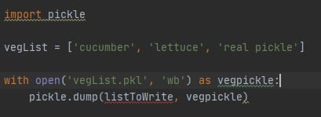
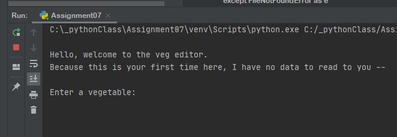
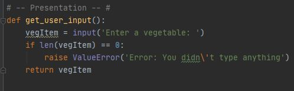
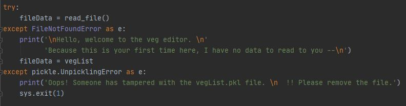

# Pickling & Error Handling  

**Tiffany Taylor**  
May 30, 2020  
Assignment07 | Pickling & Error Handling   

## Introduction  
Assignment07 through “The Foundation of Programming” course with the University of Washington asks us to demonstrate the concepts of pickling and error handling in Python. We created a single script from scratch encompassing both concepts.

## Pickle
The lecture video briefly introduced us to the concept of importing pickle and using pickle as a way to open, read, write and close external files from within a python script. The instruction was not very in depth because we were tasked with researching it a little on our own. Because I learn best through videos than reading, I chose to confirm my understanding of pickling through a few YouTube videos. [YouTube/"Python Pickle"](https://youtu.be/6wSFWOleZlc) (external link).  Basically, pickling gives us the power to translate file data into a binary data which makes the file smaller. While it looks like some kind of mysterious code, it is not encrypted or secure in any way and should not be used as such. 

To start my code, I started with the basic structure of pickling the videos were showing me using my own variables and idea which looked a little like this (Figure 1):  

  
***Figure 1: Original concept of Pickling***
  
I then wrote the similar style code for unpickling which is simply asking for the “read” argument and calling the `.load()` function. This will translate the pickled file back to standard English for us to do something with, like print it to the user. After I had these basic pickling and unpickling features set up I started to research what types of errors I might encounter. One website I browsed mentioned a `pickle.UnpicklingError` exception, so I was sure to try and figure out how to incorporate that for the second part of my script. [Python Central](https://www.pythoncentral.io/how-to-pickle-unpickle-tutorial/) (External site). I teased out other error handling options for me after I designed the program. 

## Error Handling
Before I could fully anticipate which error handling to do, I thought about what the function of the program would be. I kept it basic, where it will start the program trying to read the existing pickle file and if not found, starts with a message like in Figure 2 which is created with a `FileNotFoundError` since it would be the first time the program is ran. After this first error message is displayed if there isn’t a file, it still continues to the next “Try: Except” block for you to enter a vegetable which would then create a new file and write to it. If a file is found, it will read the current document and follow up with the same input to ask the user to add another veg to the list.  

  
***Figure 2: Start of script***

Once it reads (or asks you to start) the pickle file and enter a vegetable to add to the document, it appends the new vegetable to the file; the next time the program is run, it will have the original addition to read to the user. 

I decided to raise one exception in a function in the presentation section of my code and handle 3 exceptions in the main script. The first exception I used in the presentation function `get_user_input()` is raising `ValueError` if the user just hits return and doesn’t add anything to the screen at all (see Figure 3). 

  
***Figure 3: Code for Raising an Exception***
  
The other three handlers for exceptions I used in the “Try: Except:” format in the main script. An example of one I used is the `pickle.UnpicklingError` I mentioned earlier. This error is notated when there is bad data in the pickle file (like someone manually adding new stuff directly to the file). I also was advised by a peer to use `import sys` to use `sys.exit(1)` if this error pops up to abort anything happening. You can see here in Figure 4 the code I wrote for this unique but important error message:   

  
***Figure 4: Code for pickle.UnpicklingError***

## Summary
In summary, pickling is used to compress data to an external file in a binary format which will make the file size smaller. Pickling is used as a binary feature for opening, reading, writing and closing binary files. Error handling (or raising) is an important technique for the programmer to use to prevent random crashes of the program giving the script or the user clear hints as to what to do next if “x” error happens. Getting as specific as you can with error handling will only help the program run that much smoother for the user.  

**Tiffany Taylor**  
May 30, 2020  
Pickling & Error Handling  
Assignment07  
Repository: https://github.com/tiftaylor/IntroToProg-Python-Mod7  
GitHub Page: https://tiftaylor.github.io/IntroToProg-Python-Mod7/ 
